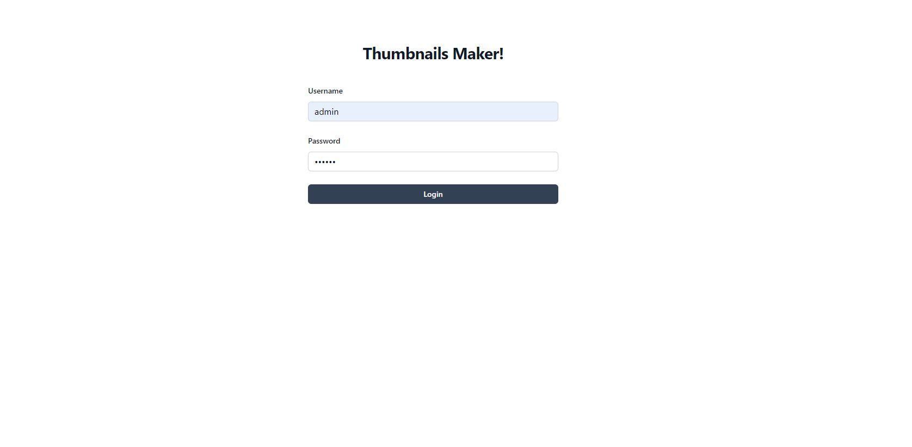
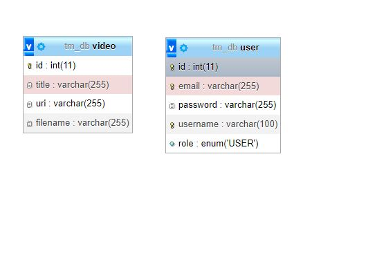

# Thumbnails-Maker

Il progeto prevedere lo sviluppo di un applicazione full stack che permette all'utente di caricare video e di generare e scaricare delle miniature relative a quel video.


## Appendice

- Funzionamento dell'applicazione
- Screenshot 
- Installazione
- Architettura Backend
- Architettura Frontend
- Possibili alternative

## Funzionamento dell'applicazione

All'avvio dell applicazione ci si trova nella pagina di login, per accedervi bisogna essere in possesso di delle credenziali valide. per aggiungere un utente, ad ora e' richiesto di inviare una richiesta http manualmente (vedi sezione installazione e utilizzo)

Una volta effettuato il login ci troviamo in una pagina dove sara' presente la lista dei video, non vedete niente ? forse perche' non ci sono video, ed al momento non e' presente un messaggio che ci avverte che i video recuperati sono 0.

Dal menu possiamo accedere alla pagina di upload, dove possiamo caricare un video nel sistema, il video verra' inviato e successivamente il server inziera' il processo di estrazione delle miniature, lo stato del processo e' visibile da un box che ci indica l'andamento di esso.

Una volta completato l'upload, tornando nella pagina dei video possiamo eliminare video o scaricare una sua miniatura.

Al click del pulsante di download ci viene mostrato un dialog in cui possiamo decidere se scaricare la miniatura secondo una risoluzione precisa oppure quella di default.

Durante la generazione delle miniature ne verranno generate una per ogni 3 secondi di video, la miniatura che noi andiamo a scaricare e' scelta casualmente tra tutte quelle generate per quel video.


## Screenshots




## Installazione e utilizzo

Dopo aver clonato il progetto.
- Assicurarsi di aver lanciato un database mysql e di aver impostato nel file delle risornse del backend le credenziali di accesso ad esso.


```bash
spring.application.name=tb-backend
spring.datasource.url=jdbc:mysql://localhost:3306/tm_db
spring.datasource.username=root
spring.datasource.password=

```

Successivamente apri il tuo IDE ed installa le dipendenze attraverso Maven.
Per avviare il backend, la migliore soluzione e' lanciarlo direttamente dall'IDE.

- Entrare dentro tm-frontend e installare le dipendenze

```bash
cd tm-frontend
npm i 
```
- Lanciare l'app 

```bash
npm run dev
```

- Per poter accedere, e' necessario creare un account inviando una richiesta Http all'endpoint di signup, ecco un esempio di JSON, tutti i dati sono obbligatori

```bash
localhost:8080/auth/signup POST 

{
    "username": "Nic",
    "password": "abc123",
    "email": "email@mail.com",
    "role": "USER"
}

```
    
## Tech Stack

**Client:** React, Typescript

**Server:** Springboot, Mysql

#### Librerie Frontend: 
- Tailwind
- React router 
- Vite

#### Librerie Backend: 
- Spring, wen, security, websocket, JPA
- jcodec 
- jjwt
- mysql connector

#### Entita' Database: 




## Backend

### Architettura

Il backend, realizzato in Springboot e' stato implementato utilizzando il pattern MVC con un architettura Onion, di seguito la directory structure e alcuni file rilevanti.

```http
    User <--> Controllers <--> Services <--> Repository <--> Database
```

```http
    App.Java
    /config
        WebConfig
        SocketConfig
        JwtConfig
    /controllers
        /auth
        /entities
            VideoController
            ThumbnailsController
            ...
        /sockets
            VideoUploadController
    /dao
    /enums
    /exception
    /handlers
        FileUploadWebSocketHandler
    /interceptor
        HttpInterceptor
        WebSocketAuthInterceptor
    /mappers
    /models
        /dtos
        /entities
        /http
            HttpResponse
        /utility
        /security
    /services
        .. uguale a controllers ..
    /staticData
        /messages
        Codes
    /validators
```

### Alcune API Importanti

#### Login

```http
  POST /auth/login
```

| Parameter | Type     | Description                |
| :-------- | :------- | :------------------------- |
| `username` | `String` | **Required**. Username |
| `password` | `String` | **Required**. Password |
| `Auth token Barear` | `String` | **Required in Header**. Api token |

#### Recupero della miniatura

```http
  GET /t/{id}
```

| Parameter | Type     | Description                       |
| :-------- | :------- | :-------------------------------- |
| `id`      | `Integer` | **Required**. Id del video da cui ricavare la miniatura |
| `width`   | `Integer` | Larghezza richiesta della miniatura |
| `height`  | `Integer` | Altezza richiesta della miniatura |
| `Auth token Barear` | `String` | **Required in Header**. Api token |

#### Upload del video e successiva generazione delle miniature 

```http
  POST /api/v1/video/upload
```

| Parameter | Type     | Description                       |
| :-------- | :------- | :-------------------------------- |
| `file`   | `File` | **Required** File video da caricare |
| `sessionId`  | `string` | **Required** id della sessione per comunicaare con la socket |
| `Auth token Barear` | `String` | **Required in Header**. Api token |


## Frontend

### Architettura

Per il frontend ho deciso di implementare un architettura gruppando file "File Types", questo perche' una directory structure by features sarebbe risultata troppo sofisticata per un progetto di questo tipo sviluppato in React, anche se vedrete un idea di implementazione di essa in Angular nella sezione *Variante Angular*.

```http
    App.Tsx
    Routes.ts
    /assets
    /atoms  #componenti senza logica
    /components #componenti che contengono logica e composti da atomi anche
    /context #conext dell applicazione
    /costants
    /hooks 
        useFetch.tsx 
        useVideoUploader.tsx 
    /interfaces
    /layout #contiene componenti di layout ri-utilizzabili 
    /pages 
        /UploadPage
        /VideoPage 
        ...
    /services 
        /http 
        /utils 
    /structure #contiene il componete che wrappa le pagine e aggiunge il layout
        ApplicationStructure.tsx 
        ErrorBoundary.tsx
```

#### useVideoUploader.tsx 
Un componente rilevante e' sicuramente useVideoUploader, un hook personalizzato che ci permette di connetterci con la websocket per monitorare lo stato di estrazione delle miniature
## Variante Angular

Avremmo potuto implementare una variante angular del frontend utilizzando la directory structure *by features*, struttura piu complessa di quella attualmente implementata , spesso implementata in progetto di medio/grandi dimensioni in Angular

```javascript
└── src/
    ├── assets/
    ├── modules/
    |   ├── core/
    │   │   ├── components/
    │   │   ├── design-system/
    │   │   │   └── Button.tsx
    │   │   ├── hooks/
    │   │   ├── lib/
    │   │   └── utils/
    │   ├── payment/
    │   │   ├── components/
    │   │   │   └── PaymentForm.tsx
    │   │   ├── hooks/
    │   │   │   └── usePayment.ts
    │   │   ├── lib/
    │   │   ├── services/
    │   │   ├── states/
    │   │   └── utils/
    │   ├── auth/
    │   │   ├── components/
    │   │   │   └── SignUpForm.tsx
    │   │   ├── hooks/
    │   │   │   └── useAuth.ts
    │   │   ├── lib/
    │   │   ├── services/
    │   │   ├── states/
    │   │   └── utils/
    │   └── employees/
    │       ├── components/
    │       │   ├── EmployeeList.tsx
    │       │   └── EmployeeSummary.tsx
    │       ├── hooks/
    │       │   ├── useEmployees.ts
    │       │   └── useUpdateEmployee.ts
    │       ├── services/
    │       ├── states/
    │       └── utils/
    └── 
}
```

Al contrario di React, angular non possiete gli hooks, quindi tutta la gestione dei dati sarebbe potuto essere implementata attraverso Services specifici, le richieste http gestite usando RxJs, e pipe Async.


## Optimizations

What optimizations did you make in your code? E.g. refactors, performance improvements, accessibility

### Traduzioni

Sarebbe potuto essere necessario gestire le stringhe con delle traduzioni 
usando: i18Next
https://www.npmjs.com/package/react-i18next

l'implementazione potrebbe essere fatta usandod ei file locali *lang.json* oppuure anche recuperando la lista delle traduzioni dal backend, all'avvio dell'applicazione

### Libreria di sockets

L'implementazione delle WebSockets lato frontend e' stata sviluppata con l'api di js WebSockets, lato backend abbiamo usato SPringBoot Sockets, sarebbe potuta essere implementata usando uno stack Stomp/SockJs 

https://www.npmjs.com/package/sockjs

Questo avrebbe comportato sia modifiche sul frontend ma anche sulla configurazione del backend.

### File Storage

Invece di inserire spudorante files all'interno della cartella assets del backend avremmo potuto usare un sistema di blob storage, come MinIO ad esempio.

https://min.io/docs/minio/linux/administration/object-management/transition-objects-to-azure.html

Questo avrebbe permesso anche l'utilizzo di un interfaccia per la gestione dei files.

### Test

Non sono stati implementati tests nel frontend, sarebbero potuti essere inseriti mediante l utilizzo di Jest. 

https://jestjs.io/docs/getting-started

Creiamo una cartella __tests__ ed inseriamo alcuni test per tipologia
Avremmo potuto creare test per funzioni logiche, come la *isJsonParsable* oppure test su componenti grafici.

```javascript
    /__tests__
        /components
            componentx.test.ts
        /logic
            utility.test.ts   
```
Inserire lo script nel *package.json*

```bash
{
  "scripts": {
    "test": "jest"
  }
}

```
Lanciarlo


```bash
npm run test
```

### Feedbacks

Un'altra miglioria sarebbe potuta essere quella relativa alla gestione dei feedback in quanto avendo strutturato il backend con delle rispsote http *HttpResponse* e dei codici specifici, avremmo potuto realizzare lato frontend dei componenti popup istanziati in base ai codici con al loro interno il testo restituito dal backend tramite http.

## Support

For support, email nicolacalise3355@gmail.com
